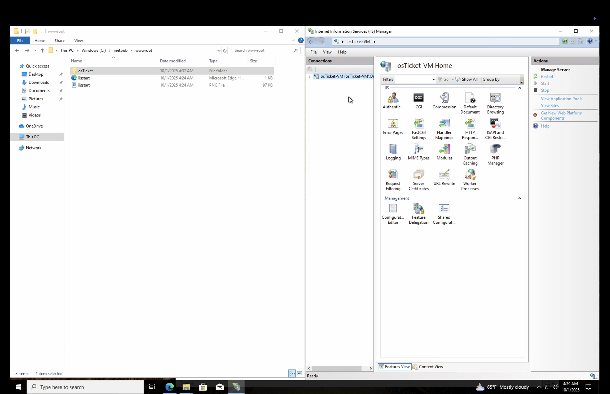
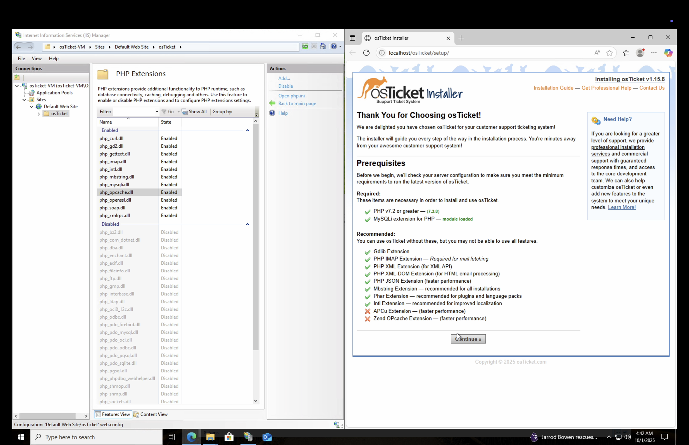
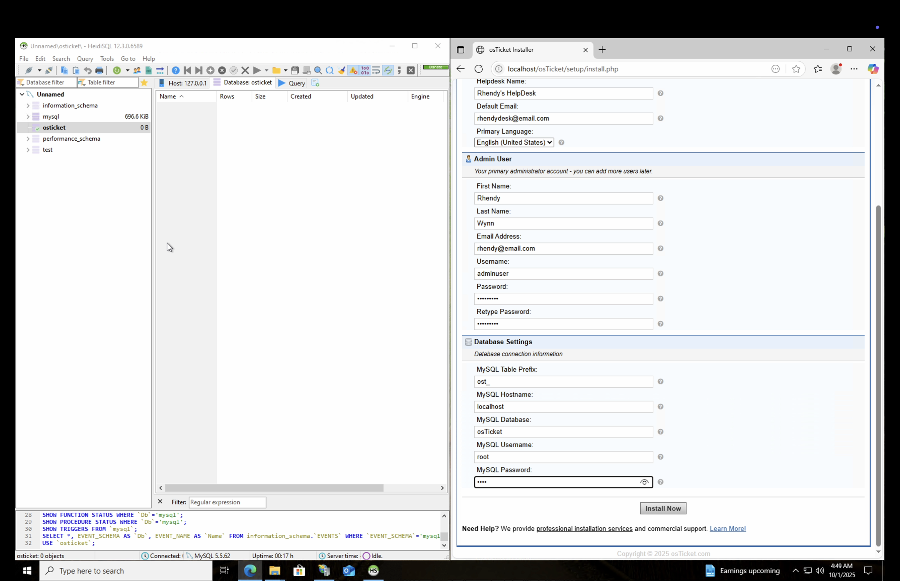

# VM-osticket-installation

<h1> Microsoft Azure VM & osTicket - Prerequisites and Installation</h1>
This project demonstrates the deployment of the open-source help desk ticketing system, osTicket, on a Microsoft Azure Virtual Machine. It highlights key IT concepts including cloud infrastructure provisioning, system configuration, and application installation in a virtualized environment. 

<h2>Video Demonstration</h2>

  

<h2>Environments and Technologies Used</h2>

- Microsoft Azure (Virtual Machines/Compute)
- Remote Desktop
- Internet Information Services (IIS)

<h2>Operating Systems Used </h2>

- Windows 10</b> (22H2)

<h2>List of Prerequisites</h2>

- Azure Subscription – so I can create a Windows 10 Virtual Machine.
- Windows 10 VM (4 vCPUs) – created in Azure and accessible with RDP.
- Valid RDP client(Windows App downloaded on MAC) – to log into the VM remotely.
- osTicket-Installation-Files.zip – available for download (containing osTicket, PHP, MySQL, IIS tools, etc.).
- Stable Internet Connection

<h2>Installation Steps</h2>

  

  Step 1: Create VM & Connect → Make an Azure Windows 10 VM → log in via Remote Desktop.

 

  

  Step 2: Prepare Files → Install IIS & Dependencies → Enable IIS with CGI → Install PHP Manager, Rewrite Module, VC_redist, and MySQL.

 

Step 3: Set Up PHP → Create <code>C:\PHP</code> → unzipped PHP 7.3.8 into it → register <code>php-cgi.exe</code> in IIS → restart IIS.

Step 4: Deploy osTicket → Unzip osTicket v1.15.8 → move “upload” folder into C:\inetpub\wwwroot\ → rename it osTicket → restart IIS.

 

Step 5: Configure osTicket → Enable PHP extensions (imap, intl, opcache) → rename ost-sampleconfig.php to ost-config.php → set permissions

 

 

Step 6: Database & Final Setup → Install HeidiSQL → create DB osTicket → finish browser setup

 

 
